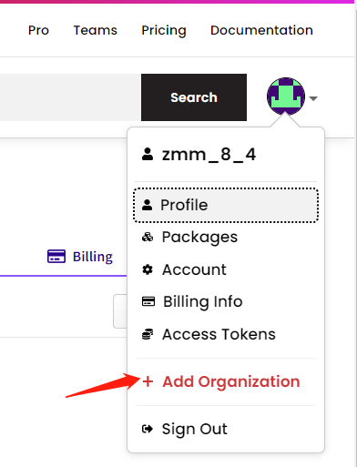
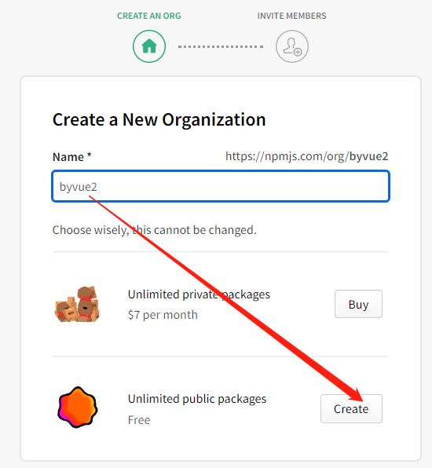
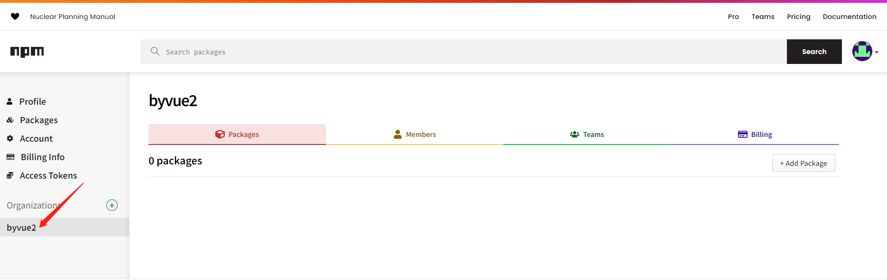

# 发布一个 npm

## npm 常用命令

| 命令                                                         | 说明                                                         |
| ------------------------------------------------------------ | ------------------------------------------------------------ |
| npm login                                                    | npm 本次登录，会要求输入用户名密码<br />如果使用 yarn login，会直接打印出已经登录的用户名、邮箱 |
| npm whoami                                                   | 查看当前用户，会打印出用户名                                 |
| npm init                                                     | 初始化 package.json，加 -y 后缀会省略询问过程                |
| npm publish                                                  | 发布包<br />yarn publish --access publi --registry=https://registry.yarnpkg.com |
| npm unpublish 包名<br />npm unpublish 包名@版本号            | 删掉发布的包或者包的某个版本<br />一般不建议删掉，免得使用的人没法继续使用，可以使用废弃代替<br />如果提示删不掉要加 --force，那么就加一下这个后缀去删 |
| npm deprecate 包名 提示信息<br />npm deprecate 包名@版本号 提示信息 | 废弃发布的包或者包的某个版本，给与废弃的提示，这样别人安装这个包时会有警告提示 |

## 发包要点

发布 npm 首先要有一个 npm 账号 [npm地址](https://www.npmjs.com/)

## 发布模块到npm后无法下载安装或版本未更新的问题

到淘宝镜像搜索你的报名：https://npmmirror.com/

然后点击：如果列出的发布版本与最新的不一致，点击 SYNC 同步最新的 npm 信息

## 发布组织内的公共包

组织内的公共包免费，私有包收费 $7 per month

### 创建组织

右上角点击头像 =》Add Organization =》填入包名 =》选择公共包



### 发布

一般组织内的包是私有发布，需要特定命令指定是公开发布

```
npm publish --access public
// yarn publish --access public --registry=https://registry.yarnpkg.com
```


# npm publish 默认的忽略规则

默认被包含，即便设置忽略也无效

```js
package.json
README(and its variants)
```

