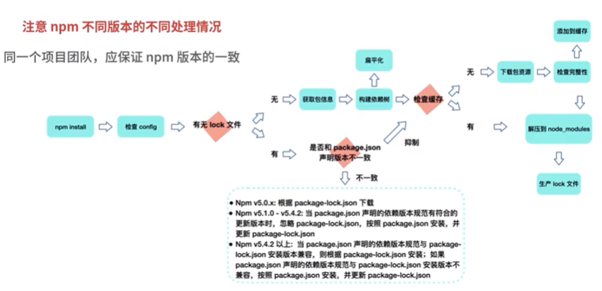

# npm 安装机制

- npm install
- 检查config：项目级 npmrc > 用户级 > 全局 > npm 内置
- 有无 lock
  - 有，与 package.json 版本是否一致
    - 一致，按照  lock 从缓存或者网络中加载依赖
    - 不一致，按照 npm 版本处理
  - 没有，检查是否有缓存
    - 有缓存，将缓存中的解压到 node_modules 中
    - 没有缓存，从远程仓库下载包，检查完整性并添加到缓存，解压到 node_modules



# npm 缓存机制

获取缓存目录：npm config get cache

- 得到类似 `C:\Users\xxx\AppData\Local\npm-cache` 。npm v5 后都放这个目录下的 _cacache 文件夹下
-  _cacache 目录
  - content-v2：二进制文件
  - index-v5：content-v2 里的文件索引
  - tmp

清除缓存：npm cache clean --force

# 常用技巧

## npm init

设置 npm init 对应的文件：npm config set int-modules ~\.npm-init.js

设置 init 默认属性值：npm config set init.author.name "zmm"

## npm link

调试脚手架非常方便

npm link 的本质就是软链接，主要做了两件事:

- pk1 中执行 npm link：为目标 npm 模块 (pk1) 创建软链接，将其链接到全局 node 模块安装路径 /usr/local/lib/node_modules/ 中
- pk2 中执行 npm link pk1： 为目标 npm 模块 (pk1) 的可执行 bin 文件创建软链接将其链接到全局 node 命令安装路径 /usr/local/bin/ 中

## npx

npm install 

# npm 镜像

原镜像：

- npm config set registry https://registry.npmjs.org 

国内：

- npm config set registry https://registry.npm.taobao.org 

- npm config set registry https://registry.yarnpkg.com

## 使用nrm管理registry地址-未成功使用

```
npm install -g nrm
```

1. 添加源

nrm add npm http://registry.npmjs.org
nrm add taobao https://registry.npm.taobao.org

2. 使用源

nrm use taobao
nrm use npm

3. 删除源

nrm del taobao

4. 查看源列表

nrm ls

5. 测试源速度(响应速度)

nrm test taobao

6. 查看当前使用源

nrm current


### 报错

1. 无法加载 nrm：以管理员身份运行cmd
2. 安装后运行命令：const open = require('open');require() of ES Module not supported.


