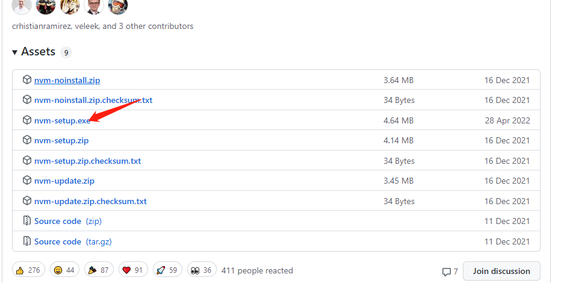
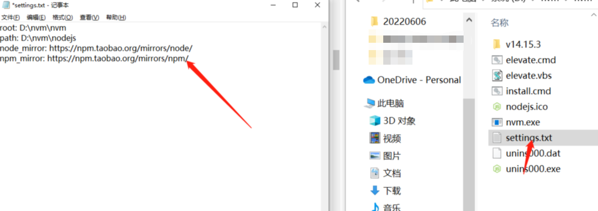

https://github.com/coreybutler/nvm-windows/releases 下载安装包



- 在 D:\新建目录 nvm，nvm 下新建目录 nodejs，在安装过程中nvm放nvm之下，node就选择 nodejs 目录（D:\nvm\nvm，D:\nvm\nodejs）
- 安装之后，打开根目录下的setting.txt文件，设置nvm和node镜像源



```txt
root: D:\nvm\nvm
path: D:\nvm\nodejs
node_mirror: https://npm.taobao.org/mirrors/node/
npm_mirror: https://npm.taobao.org/mirrors/npm/
```

- 命令行中输入命令验证是否成功：nvm -v
- 安装对应版本的 node ：nvm install 14.17.0
- 使用某个版本的 node ：nvm use 14.17.0（需要管理身份运行命令行工具）
- 查看所有 node：nvm ls（前有*表示当前使用的版本）

