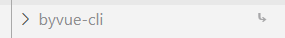
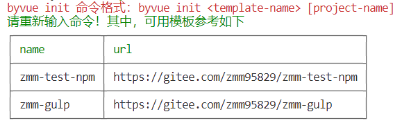
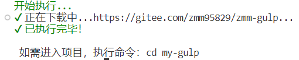
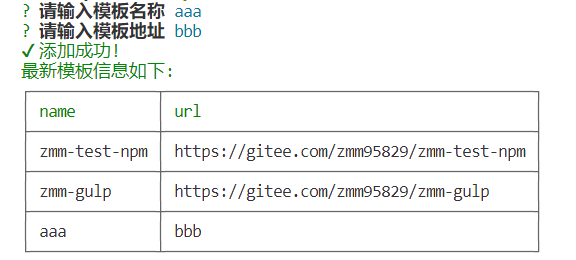
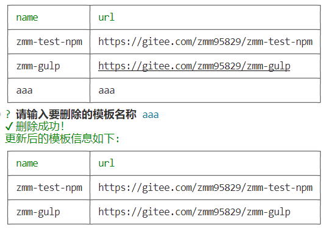

# 脚手架说明

[源码地址](https://github.com/zmm95829/byvue-cli)

## 成果 - 这个脚手架能干啥

1. byvue list：列出脚手架中能安装的模板信息【名称: 地址】
2. byvue delete：删除某个模板信息
3. byvue add：添加某个模板信息
4. byvue init：初始化某个模板信息【从远程仓库中拉取代码并自动安装依赖】

## 目录结构

```txt
.
├─ bin 【脚手架命令文件夹】
│  └─ byvue 【byvue 相关命令文件】
├─ src 【命令执行逻辑源码文件夹】
│  ├─ byvue 【byvue 命令相关逻辑文件夹】
│  │   ├─ commands 【命令文件夹】
│  │   │  └─ add.js【添加模板的逻辑文件】
│  │   │  └─ delete.js【删除模板的逻辑文件】
│  │   │  └─ init.js【初始化模板的逻辑文件】
│  │   │  └─ list.js【列出模板信息的逻辑文件】
│  │   └─ template.json【模板信息数据】
│  ├─ util 【工具函数文件夹】
│  │   └─ index.js【未分类的工具函数文件】
│  │   └─ install.js【安装依赖的工具函数文件】
├─ .gitignore 【git忽略文件】
├─ node_modules 【依赖文件夹】
└─ package.json 【项目配置信息】
```


## 使用到的第三方库

- commander：命令行工具
- download-git-repo：下载远程模板
- inquirer：交互式命令行工具
- ora：显示 loading 动画
- chalk：修改控制台输出内容样式
- log-symbols：显示出 √ 或 × 等的图标
- cross-spawn：执行依赖安装命令

# 开发环境

- nodejs
- git
- yarn：使用 npm 全局安装 yarn：npm install -g yarn【后面的示例都是 yarn 命令，如果不想使用 yarn 的也可以不安装，后面的命令自行替换为 npm 的相关命令】

# 从零开始

## 搭建简单项目结构

- 创建一个文件夹 byvue-li

- 初始化 packge.json 文件：yarn init -y
  ```js
  {
    "name": "byvue-cli",
    "version": "1.0.0",
    "main": "index.js",
    "license": "MIT",
    "author": {
      "name": "zmm",
      "email": "1239183642@qq.com"
    },
    "bin": {
      "byvue": "bin/byvue"
    },
    "keywords": [
      "byvue-cli",
      "byvue"
    ]
  }
  
  ```

  - bin：脚手架命令所对应的文件位置

- 初始化 git：git init

  - 新建 .gitignore
    ```
    node_modules
    
    *-error.log
    ```

- 新建 bin/byvue 文件【无后缀名】
  ```js
  #! /usr/bin/env node 
  
  console.log(3333333333)
  ```

  这是一个可执行程序，头部必须有 `#! /usr/bin/env node `

## 简单本地测试

在脚手架项目下执行 yarn link，将该项目 byvue-cli 关联到全局

在另一个项目中【可以随便一个文件中】测试，执行 yarn link byvue-cli，可以看到这个项目的 node_modules 目录下有 byvue-cli 这个依赖，右侧的图标表示这个不是从远端下载的，而是本地执行 link 关联的【或者就直接在脚手架的项目中也行】



然后执行 byvue 命令，可以看到控制台打印出了 `3333333333`

## 编写指令，实现相应逻辑

新建 src/byvue/commands 目录，有几个指令就在其下建几个 js 文件

###  bin/byvue

这个是命令的入口，不同的命令需要执行不同的文件逻辑，所以在 byvue 中进行分发

- 安装依赖：commander

```js
#!/usr/bin/env node

const program = require('commander')

program.usage('<command>')

program.version(require('../package').version)

program
  .command('list')
  .description('模板列表')
  .action(() => {
    require('../src/byvue/commands/list') // 将 list 命令指向 src/commands/list 文件去执行
  })

program.parse(process.argv)
```

在 list.js 中

 ```console.log("this is my list")```

在测试项目中执行 byvue -h，可以看到打印如下

```
Usage: byvue <command>

Options:
  -V, --version   output the version number
  -h, --help      display help for command

Commands:
  list            模板列表
  help [command]  display help for command
```

在测试项目中执行 byvue list，可以看到打印如下

```
this is my list
```

### commands：list

>  以表格形式将模板信息展示出来

- yarn add cli-table

list.js：将模板数据传入打印表格函数中以展示模板数据

```js
const { showTable } = require(`${__dirname}/../../util/index`)
const templateList = require(`${__dirname}/../template`)

showTable(templateList)
```

util/index.js：读取模板数据，使用表格形式打印出来

```js
const Table = require('cli-table')

const table = new Table({
  head: ['name', 'url'],
  style: {
    head: ['green']
  }
})

function showTable (tempList, needExit = true) {
  // 需要将表格清空，不然会无限添加
  table.length = 0
  const list = Object.keys(tempList)
  if (list.length > 0) {
    list.forEach((key) => {
      table.push([key, tempList[key]])
      if (table.length === list.length) {
        console.log(table.toString())
        needExit && process.exit()
      }
    })
  } else {
    console.log(table.toString())
    needExit && process.exit()
  }
}

exports.showTable = showTable
```

template.json

```js
{
  "zmm-test-npm": "https://gitee.com/zmm95829/zmm-test-npm",
  "zmm-gulp": "https://gitee.com/zmm95829/zmm-gulp"
}
```

在测试项目中执行：byvue list，可以看到打印如下：

```
┌──────────────┬─────────────────────────────────────────┐
│ name         │ url                                     │
├──────────────┼─────────────────────────────────────────┤
│ zmm-test-npm │ https://gitee.com/zmm95829/zmm-test-npm │
├──────────────┼─────────────────────────────────────────┤
│ zmm-gulp     │ https://gitee.com/zmm95829/zmm-gulp     │
└──────────────┴─────────────────────────────────────────┘
```

### commands：init

> 步骤：
>
> - 通过命令行让用户输入模板名称和项目名称
> - 检验模板是否存在，项目名称是否填写
> - 显示加载图标，下载模板
> - 模板下载完成，隐藏图标

在 byvue 中将命令指向相应的文件上去

```js
program
  .command('init')
  .description('初始化一个项目')
  .action(() => {
    require('../src/byvue/commands/init')
  })
```

- 安装相关依赖 yarn add download-git-repo ora
  - 不要单独安装 log-symbols 和 chalk，因为安装 ora 时已经安装了，如果还要单独执行命令，会安装最新版的依赖，导致没法使用 require

init.js

```js
const program = require("commander")
const download = require("download-git-repo")
const ora = require("ora")
const templateList = require(`${__dirname}/../template`)
const symbols = require("log-symbols")
const chalk = require("chalk")
chalk.level = 1

program.usage("<template-name> [project-name]")
program.parse(process.argv)

// 当没有输入参数的时候给个提示
if (program.args.length < 2) {
  console.log(chalk.red("byvue init 命令格式：byvue init <template-name> [project-name]"))
  console.log(chalk.green("请重新输入命令！其中，可用模板参考如下"))
  // 将模板信息打印一下
  require("./list")
  return
}

// 0:init 1:模板名 2:项目名
let templateName = program.args[1]
let projectName = program.args[2]

if (!templateList[templateName]) {
  // 模板不存在，红色显示提示
  console.log(chalk.red(`模板【${templateName}】不存在！`))
  return
}

if (!projectName) {
  // 没有输入项目名称，默认使用模板名称代替
  projectName = templateName
}

let url = templateList[templateName]

// 提示开始
console.log(chalk.green("开始执行..."))

// 出现加载图标
const spinner = ora("正在下载中..." + templateList[templateName] + "...")
spinner.start()

download(`direct:${url}`, `./${projectName}`, { clone: true }, (err) => {
  if (err) {
    spinner.fail()
    console.log(chalk.red(symbols.error), chalk.red(`执行失败${err.toString()?.includes("git clone") ? "【请检查当前目录下是否已经存在同名项目】" : ""}： ${err}`))
    return
  }
  // 结束加载图标
  spinner.succeed()
  console.log(chalk.green(symbols.success), chalk.green("已执行完毕！"))
  console.log(`\n 如需进入项目，执行命令：cd ${projectName}`)
})
```

测试项目中，执行 byvue init，打印如下



执行 byvue init zmm-gulp my-gulp ，打印如下



并且在执行命令的根目录下已经得到了 my-gulp，内容是 zmm-gulp 的内容

#### 自动安装依赖

byvue 中，先定义好模板名称是必填，项目名称非必填【未填时，默认取模板名称作为项目名称】

```
program
  .command('init <模板名称> [项目名称]')
  .description('初始化一个项目')
  .action(() => {
    require('../src/byvue/commands/init')
  })
```

init.js 中，下载模板之前先询问是使用 npm 还是 yarn 安装依赖

```js
const program = require("commander")
const download = require("download-git-repo")
const ora = require("ora")
const templateList = require(`${__dirname}/../template`)
const symbols = require("log-symbols")
const chalk = require("chalk")
chalk.level = 1
const { install } = require('../../util/install')
const defaultCommand = "yarn"
const path = require("path")
const inquirer = require("inquirer")

function initTemplate() {
  return new Promise((resolve, reject) => {
    // 当没有输入参数的时候给个提示
    // if (program.args.length < 2) 
    // 不可能进入上面的判断，因为 commander 设置 command 的时候已经要求模板名称必填了

    // 0:init 1:模板名 2:项目名
    let templateName = program.args[1]
    let projectName = program.args[2]

    if (!templateList[templateName]) {
      // 模板不存在，红色显示提示
      console.log(chalk.red(`模板【${templateName}】不存在！`))
      reject();
      return
    }

    if (!projectName) {
      // 没有输入项目名称，默认使用模板名称代替
      projectName = templateName
    }

    return beforeInit(projectName)
      .then(installOptions => {
        let url = templateList[templateName]

        // 提示开始
        console.log(chalk.green("开始执行..."))

        // 出现加载图标
        const spinner = ora("正在下载模板..." + templateList[templateName] + "...")
        spinner.start()

        return new Promise((subResolve, subRreject) => {
          download(`direct:${url}`, `./${projectName}`, { clone: true }, (err) => {
            if (err) {
              spinner.fail()
              console.log(chalk.red(symbols.error), chalk.red(`执行失败${err.toString()?.includes("git clone") ? "【请检查当前目录下是否已经存在同名项目】" : ""}： ${err}`))
              subRreject();
              return
            }
            // 结束加载图标
            spinner.succeed()
            console.log(chalk.green(symbols.success), chalk.green("模板下载完毕！"))
            subResolve();
          })
        })
          .then(() => {
            resolve(installOptions)
          })
          .catch(v => {
            reject(v)
          })
      })
  })
}

// 初始化之前先询问
function beforeInit(projectName) {
  const question = [
    {
      name: "command",
      type: "input",
      message: "请输入依赖安装方式【yarn or npm】，默认 " + defaultCommand,
      validate(val) {
        if (!val) {
          // 走默认 yarn
          return true
        } else if (val !== "yarn" && val !== "npm") {
          return `请在【yarn、npm】中选择一种`
        } else {
          return true
        }
      }
    }
  ]
  return inquirer.prompt(question).then((answers) => {
    let { command } = answers
    command = command || defaultCommand;
    const cwd = process.cwd();
    return {
      command,
      // 拼接需要安装依赖的路径
      cwd: path.resolve(cwd, projectName),
      projectName
    }
  })
}

initTemplate()
  .then(options => {
    console.log(chalk.green("开始下载依赖..."))
    return install(options);
  })
  .then(({projectName}) => {
    console.log(chalk.green(symbols.success), chalk.green(`执行完成，如需进入项目，执行命令：cd ${projectName}`))
  })
  .catch(error => {
    if (error) {
      console.log(chalk.red(symbols.error), chalk.red(error))
    }
  })

```


### commands：add

> 步骤：
>
> - 通过命令行，让用户输入模板名称和模板地址
> - 检查模板名称或地址是否已经存在
> - 将模板信息写入到 template.json 文件中
> - 打印所有模板信息

- 安装相关依赖：yarn add inquirer

在 byvue 中将命令指向相应的文件上去

```js
program
  .command('add')
  .description('添加一个模板信息')
  .action(() => {
    require('../src/byvue/commands/add')
  })
```

add.js

```js
const inquirer = require("inquirer")
const fs = require("fs")
const templateList = require(`${__dirname}/../template`)
const { showTable } = require(`${__dirname}/../../util/index`)
const symbols = require("log-symbols")
const chalk = require("chalk")
chalk.level = 1
const question = [
  {
    name: "name",
    type: "input",
    message: "请输入模板名称",
    validate(val) {
      if (!val) {
        return "请输入模板名称!"
      } else if (templateList[val]) {
        return `该模板已经存在！【${val} => ${templateList[val]}]`
      } else {
        return true
      }
    }
  },
  {
    name: "url",
    type: "input",
    message: "请输入模板地址",
    validate(val) {
      if (!val) {
        return "请输入模板地址"
      } else {
        for(let key in templateList) {
          if (templateList[key] === val) {
            return `该模板已经存在！【${key} => ${templateList[key]}]`
          }
        }
        return true
      }
    }
  }
]
inquirer.prompt(question).then((answers) => {
  let { name, url } = answers
  templateList[name] = url.replace(/[\u0000-\u0019]/g, "") // 过滤 unicode 字符
  fs.writeFile(`${__dirname}/../template.json`, JSON.stringify(templateList), "utf-8", (err) => {
    if (err) console.log(chalk.red(symbols.error), chalk.red(err))
    console.log(chalk.green(symbols.success), chalk.green("添加成功!"))
    console.log(chalk.green("最新模板信息如下: "))
    showTable(templateList)
  })
})
```

在测试项目中，执行 byvue add，然后根据提示信息进行操作



### commands：delete

> 步骤：
>
> - 展示所有的模板信息
> - 通过命令行，让用户输入要删除的模板名称
> - 检查模板名称是否存在
> - 将模板信息从 template.json 文件中删除
> - 打印所有模板信息

在 byvue 中将命令指向相应的文件上去

```js
program
.command('delete')
.description('删除一个模板信息')
.action(() => {
  require('../src/byvue/commands/delete')
})
```

delete.js

```js
const inquirer = require("inquirer")
const fs = require("fs")
const templateList = require(`${__dirname}/../template`)
const { showTable } = require(`${__dirname}/../../util/index`)
const symbols = require("log-symbols")
const chalk = require("chalk")
chalk.level = 1

// 展示所有模板信息
showTable(templateList, false)

const question = [
  {
    name: "name",
    message: "请输入要删除的模板名称",
    validate(val) {
      if (!val) {
        return "请输入要删除的模板名称！"
      } else if (!templateList[val]) {
        return `模板【${val}】不存在！`
      } else {
        return true
      }
    }
  }
]

inquirer.prompt(question).then((answers) => {
  const { name } = answers
  delete templateList[name]
  fs.writeFile(`${__dirname}/../template.json`, JSON.stringify(templateList), "utf-8", (err) => {
    if (err) console.log(chalk.red(symbols.error), chalk.red(err))
    console.log(chalk.green(symbols.success), chalk.green("删除成功！"))
    console.log(chalk.green("更新后的模板信息如下: "))
    showTable(templateList, false)
  })
})
```

测试项目中执行 byvue delete，然后根据提示信息进行操作 


> 参考：
>
> - [从零搭建一个前端cli脚手架并发布到npm](https://juejin.cn/post/7010673349571379231)


# 相关技巧

## 在一个命令逻辑中如何调用另一个命令

比如说，在初始化模板【byvue init】的时候，如果用户没有输入模板，则程序自动将模板信息打印一下

在要执行的代码中，直接使用 `require('./list')` 引入 `byvue list` 所在文件即可

## 使用 download-git-repo 下载完项目后自动安装依赖

- yarn add cross-spawn

```js
const spawn = require('cross-spawn');

function install(options) {
  // command 指 yarn 或者 npm
  // cwd 是要安装依赖的那个项目目录
  const {command, cwd} = options;
  return new Promise((resolve, reject) => {
    const args = ['install', '--save', '--save-exact', '--loglevel', 'error']
    const child = spawn(command, args, {
      cwd,
      stdio: ['pipe', process.stdout, process.stderr],
    })

    child.once('close', (code) => {
      if (code !== 0) {
        reject({
          command: `${command} ${args.join(' ')}`,
        })
        return
      }
      resolve(options)
    })
    child.once('error', reject)
  })
}
exports.install = install
```

