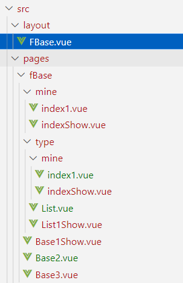
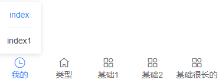

# 需求

将一个项目的框架部分打包为 npm，执行相应的命令可以完成本地启动、编译

假设这个已经完成的 npm 是对 vite + vue2 + vant 的一个封装【命名为 byvue-mobile】

1. 执行 byvue-mobile，可以本地启动 vue 项目
2. 执行 byvue-mobile build 可以打包
3. 执行 byvue-mobile serve 可以预览 dist 目录下的已编译好的项目
4. 根目录 host.js，可以区分不同环境配置
5. 根目录 pages 下可以放业务相关代码

细节：

1. vue2使用vite如何设置不同的@指向不同的目录

   1. 考虑将代码赋值到 byvue-mobile 的项目目录下

   2. 

# 所需知识

- 脚手架命令执行逻辑
- 发布 npm
- 脚手架相关
  - commander
- vite

# 参考 vitepress


# 参考 nuxt+vite

[Nuxt源码精读](https://juejin.cn/post/6917247127315808270)

## 


# 使用

## 了解一下 byvue-mobile

byvue-mobile = 脚手架逻辑 + vue 项目框架部分

## 脚手架逻辑

项目中安装了 byvue-mobile 依赖后，可以执行 byvue-m 的命令了

在执行 vite 命令前

- 确保 src 下存在 main.js，这个是给因为保留的一个入口文件，必须存在【后续可优化】
- 确保更目录下存在 .byvue 目录，因为 vite 启动、打包是基于这个目录进行的。具体逻辑见 [如何得到 .byvue](# 如何能得到)
- 自动生成路由


## vue 项目框架部分

将常用的、一般不修改的、不被业务影响的部分提取出来，放着了 app 目录下，在 vue 项目运行时，这部分代码是不可缺少的

## 了解一下 .byvue

### .byvue 有啥用

vue 项目的一部分，只有 .byvue + 当前跟项目下的代码组合，才是一个完整的项目

### 如何能得到

运行 byvue-m 命令时，脚手架中会检查当前根目录下是否存在 .byvue

- 如果存在，继续比较当前存在的版本与 byvue-mobile 版本是否一致
  - 一致，不需要操作 byvue
  - 不一致，先将这个目录删掉，然后将 byvue-mobile 下的 app 目录给拷贝到这里作为 .byvue
- 不存在，将 byvue-mobile 下的 app 目录给拷贝到这里作为 .byvue

## 相对路径符合的使用

@：表示根目录下 src 目录

$：表示 .byvue 的 src 目录

## 自动生成路由规则

对 src 下，非 modules 文件夹下的 vue 文件进行生成路由规则

form[id]：form/:id

form[id-]：form/:id?

## 底部导航规则

1. 以 【f + 类型】如 fBase 这种驼峰命名方式建文件夹【src/pages/fBase】，表示这个文件夹下的文件对应的路由可以渲染底部导航栏，需要该导航栏的路由，需要将 vue 文件都放在该文件夹下，并且以关键词 Show 结尾【比如 src/pages/fBase 目录下，Base1.vue，表示这个组件对应的路由不需要渲染底部导航，Base2Show.vue 对应的路由表示需要渲染底部导航】
   
2. 在 src/layout 下创建对应名称的布局组件，可以直接引入 $/layout/FooterView.vue 组件使用，传入 items 参数作为底部导航栏的渲染数据

### 举例

假如说有一个业务需要渲染底部导航数据有：我的、类型、基础1、基础2、基础很长的名字，其中，“我的”有二级菜单，“类型”有三级菜单，基础x 中只有“基础1”需要渲染底部导航

这时候，源码目录结构如下



渲染效果


点击“我的”，展开显示二级菜单




点击“类型”-“我的”，展开三级菜单


其中，FBase 内容如下：

```vue
<template>
  <FooterView :items="items" />
</template>
<script>
import FooterView from "$/layout/FooterView.vue";
export default {
  name: "FCmsView",
  components: {
    FooterView
  },
  data: function() {
    return {
      items: [
        {
          path: "/base/mine",
          icon: "clock-o",
          label: "我的",
          children: [
            {
              path: "/base/mine/index",
              label: "index"
            },
            {
              path: "/base/mine/index1",
              label: "index1"
            }
          ]
        },
        {
          path: "/base/type",
          icon: "wap-home-o",
          label: "类型",
          children: [
            {
              path: "/base/type/list",
              label: "类1"
            },
            {
              path: "/base/type/mine",
              label: "我的",
              children: [
                {
                  path: "/base/type/mine/index1",
                  label: "我的1"
                },
                {
                  path: "/base/type/mine/index",
                  label: "我的很长名字"
                }
              ]
            },
            {
              path: "/base/type/list1",
              label: "类2"
            }
          ]
        },
        {
          path: "/base/base1",
          icon: "apps-o",
          label: "基础1"
        },
        {
          path: "/base/base2",
          icon: "apps-o",
          label: "基础2"
        },
        {
          path: "/base/base3",
          icon: "apps-o",
          label: "基础很长的名字"
        }
      ]
    };
  }
};
</script>
<style scoped lang="less">
</style>

```

其中：

- path：表示跳转的路由地址
- label：表示显示的文字，在一级菜单中，最多只允许显示5个字
- icon：表示显示的图片，仅一级菜单有效
- children：表示下一级菜单的信息。一共只支持展示三级菜单

### 注意事项

- pages 下的布局文件夹必须是小写的 f 开头，并且 f 后面的字母必须是大写
- layout 下的布局组件必须是大写的 F 开头，后续的与 pages 下的布局文件夹命名保持一致

# 其他

## process

[参考](https://vue3js.cn/interview/NodeJS/process.html#%E4%B8%80%E3%80%81%E6%98%AF%E4%BB%80%E4%B9%88)

## import 导入 json

import packageJson from "../package.json" assert { type : 'json' };

## nodejs 中如何判断执行命令是 yarn 还是 npm

process.env.npm_execpath 会得到命令所在文件如：D:\nvm\nvm\v16.18.0\node_modules\yarn\bin\yarn.js 


## 步骤

目录逻辑


# 问题

1. Error: spawn C:\WINDOWS\system32\cmd.exe

   进入到这个目录下去执行相关命令操作

   ```js
   import path from 'path'
   const __dirname = path.resolve();
   const appDirname = path.join(__dirname, "../../app");
   import process from "child_process";
   console.log(343434, __dirname, appDirname)
     process.exec('yarn dev', {
     cwd: appDirname
     }, function (error, stdout, stderr) {
       console.log("zmmmmerr", "error：" + error, "stdout:" + stdout, "stderr:" + stderr)
     })
   
   ```

   报错：error：Error: spawn C:\WINDOWS\system32\cmd.exe ENOENT stdout: stderr:

   修改用户变量path，增加C:\Windows\System32，并没解决，传 shell option 把 exe 的地址传入，好像也不行，改为使用cross-spawn

2. TypeError [ERR_INVALID_URL_SCHEME]: The URL must be of scheme file
   import 时传入的文件路径不是正确路径，比如 "E:\\xx\m.config.js" 应该改为 "E:\\xx\m.config.js"，还是报错 Error [ERR_UNSUPPORTED_ESM_URL_SCHEME]: Only URLs with a scheme in: file, data are supported by the default ESM loader. On Windows, absolute paths must be valid file:// URLs. Received protocol 'e:'
   改为 fs 读取 json 文件了

   ```js
   import fs from 'fs'
   const config = fs.readFileSync(mConfigName, "utf-8");
   
   ```

3. 生成自动router，没法将带有函数值的数组写到js文件中去
   全部直接以字符串的形式累加，然后写js中去

4. 如果框架代码没有在项目代码的路径上，引入 vue 报错找不到依赖
   