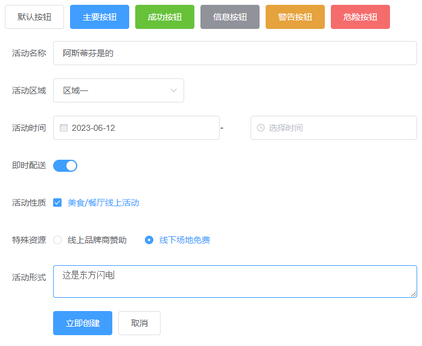
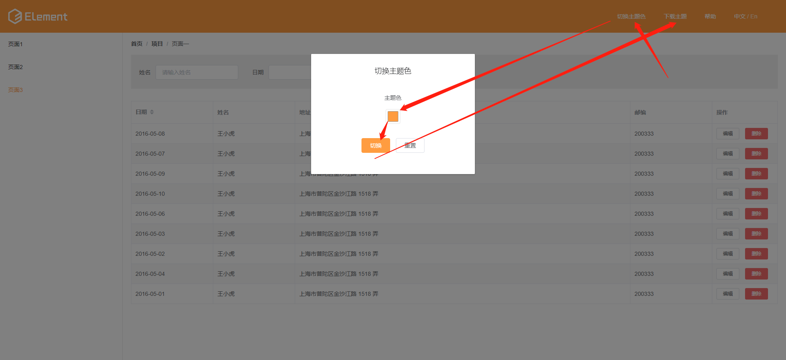
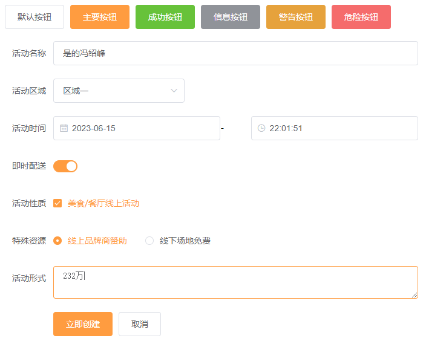
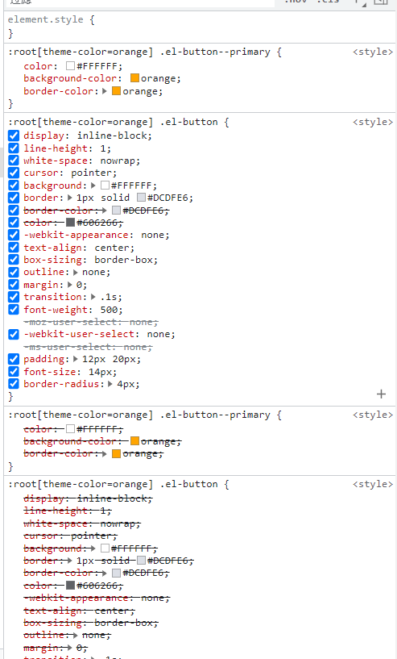
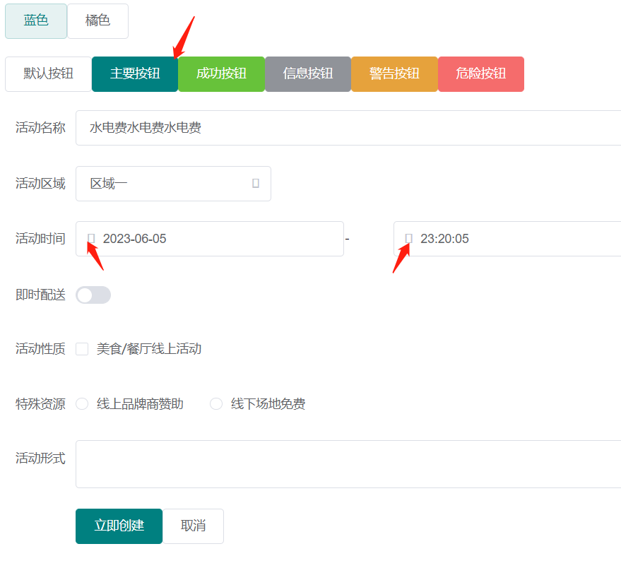

# 不同思路细节

参考： https://juejin.cn/post/7134594122391748615

## link标签动态引入

<demo src="./components/Link.vue"></demo>

思路：

- 不同主题放不同的 css 文件中，切换时，更换在 link 标签的引入路径
- 初始化时，给加载一个默认的样式文件

特点：

- 首屏非全量加载样式-按需加载，动态加载样式文件，切换可能会卡顿


## 提前引入所有主题样式，做类名切换

<demo src="./components/ToggleClass.vue"></demo>

思路：

- 切换主题样式时，给根元素（比如说 html、 body）切换不同的样式名
- 在样式文件中，不同根样式名下定义不同的样式

特点：

- 首屏全量加载样式，切换不会卡顿

## CSS变量+类名切换

<demo src="./components/ToggleClassAndCssVariable.vue"></demo>

思路：

- 切换主题样式时，给根元素（比如说 html、 body）切换不同的样式名
- 在不同的根类名下定义不同的 [css 变量](https://developer.mozilla.org/zh-CN/docs/Web/CSS/Using_CSS_custom_properties) 值，定义元素样式的时候，值使用变量名

特点：

- 首屏全量加载样式，切换不会卡顿

## mixin + 类名切换

[css 预处理器使用参考](/css/css-preprocessor/预处理器使用对比)

<demo src="./components/PreprocessorMixin.vue"></demo>
思路：

- 切换主题样式时，给根元素（比如说 html、 body）切换不同的样式名
- 利用预处理器定义变量和混入的特性,使不同类名下得到不同样式 -- 将同属性不同主题放一起方便维护

特点：

- 首屏全量加载样式，切换不会卡顿

## CSS变量+动态setProperty

<demo src="./components/CssVariableAndSetProperty.vue"></demo>

思路：
- 给元素定义的样式使用变量，默认给个默认[变量](https://developer.mozilla.org/zh-CN/docs/Web/CSS/Using_CSS_custom_properties)值，切换主题时，[动态更换根元素上的变量值](https://developer.mozilla.org/zh-CN/docs/Web/API/CSSStyleDeclaration/setProperty)

特点：

- 首屏全量加载样式，切换不会卡顿

# 常用项目框架下的主题切换方案

## vue2-[elementui](https://element.eleme.cn/2.15/#/zh-CN/component/custom-theme)

### 默认

vue2 + elementui 在 main.js 中

```js
import '../theme/index.css'
import ElementUI from 'element-ui'
import Vue from 'vue'

Vue.use(ElementUI)
```


默认主题是蓝色



### 使用在线主题生成工具-仅切换主题色

> - 仅能修改主题色
> - 开发确定之后使用用户自己没法动态修改自己喜欢的主题

使用[在线主题生成网站](https://elementui.github.io/theme-chalk-preview/#/zh-CN)，修改主题色后将样式文件下载下来然后解压放 src\assets 目录下，将原本的样式文件的引入替换为新的



```js
// import 'element-ui/lib/theme-chalk/index.css';
import "./assets/element-#FF9C40/index.css"
```



### 使用在线主题生成器

> 开发确定之后使用用户自己没法动态修改自己喜欢的主题

使用 [在线主题编辑器](https://element.eleme.cn/2.15/#/zh-CN/theme) 切换各种变量颜色，可以修改整个UI库的色彩体系，修改后，下载文档，将 theme 文件夹放 src/assets 下，main.js 中引入这个 theme 下的 index.css

```js
import "./assets/theme/index.css"
```

### 使用 scss 变量覆盖默认样式

>  开发确定之后使用用户自己没法动态修改自己喜欢的主题

先在项目中安装上 sass

```js
yarn add sass-loader -D
yarn add node-sass -D
```

在 src/assets 下创建 element-variables.scss

```js
// @import 'element-ui/lib/theme-chalk/index.css';

/* 改变主题色变量 */
$--color-primary: teal;

/* 改变 icon 字体路径变量，必需 */
$--font-path: '~element-ui/lib/theme-chalk/fonts';

@import "~element-ui/packages/theme-chalk/src/index";
```

main.js 中不要引入 elementui 相关样式了，直接引入 element-variables.scss

```js
import "./assets/element-variables.scss"
```

### 主题插件生成样式文件

可参考官网 [命令行工具](https://element.eleme.cn/2.15/#/zh-CN/component/custom-theme#ming-ling-xing-zhu-ti-gong-ju) 

有点像将在线主题生成器放到线下使用，不过线下的插件可以修改更多的变量，包含了主题所用到的所有变量

### 用户动态切换主题

在 scss 变量的方式上，scss 文件内容改为

```scss
:root[theme-color=teal] {
  $--color-primary: teal;
  $--font-path: '~element-ui/lib/theme-chalk/fonts';

  @import "~element-ui/packages/theme-chalk/src/index";
}

:root[theme-color=orange] {
  $--color-primary: orange;
  $--font-path: '~element-ui/lib/theme-chalk/fonts';

  @import "~element-ui/packages/theme-chalk/src/index";
}
```

 在示例中发现适用的样式重复定义好几次，而且样式有些小问题



