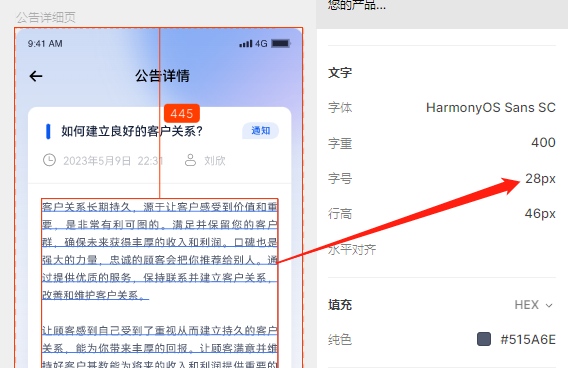
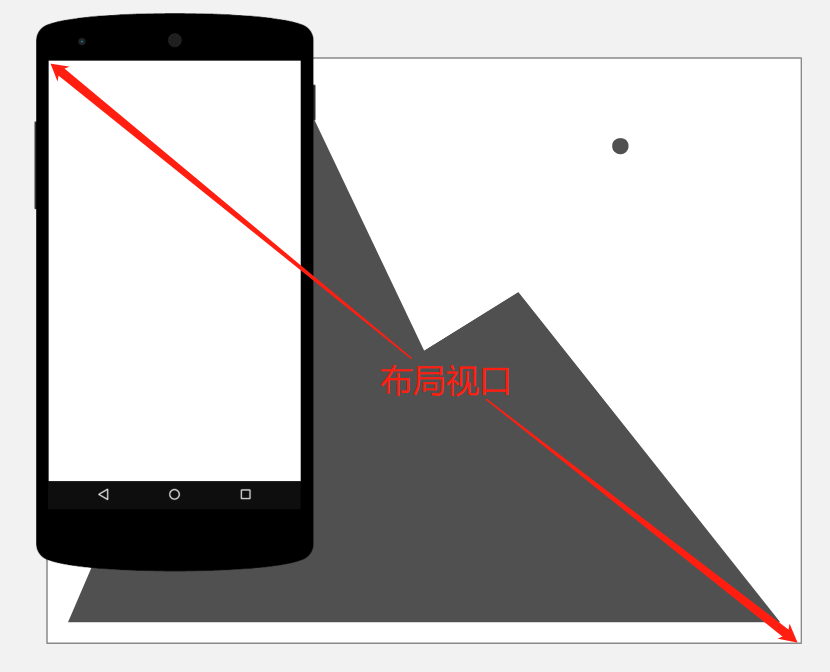
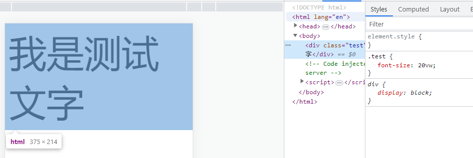
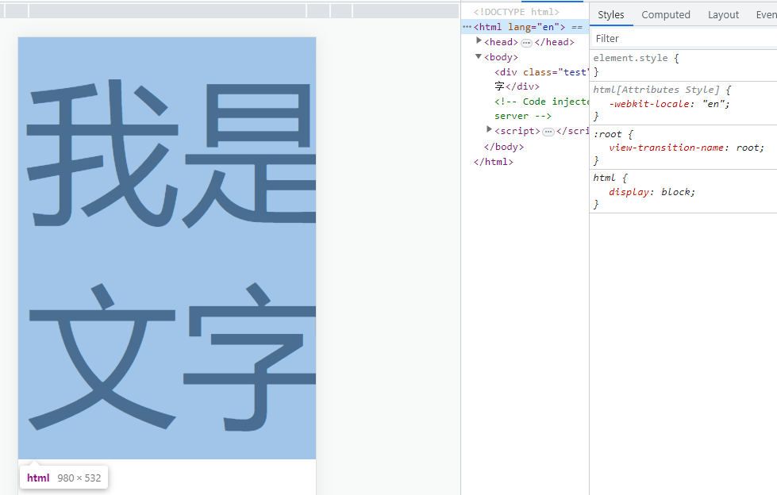
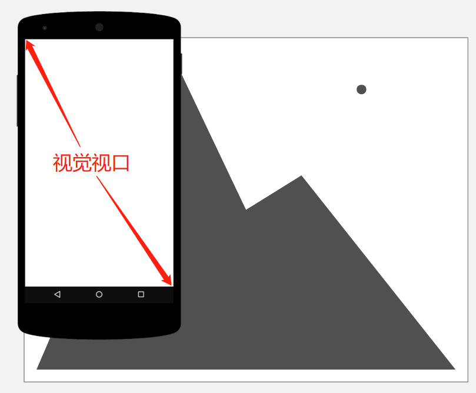
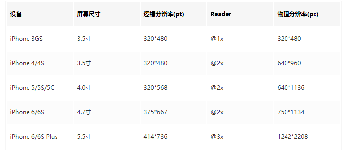
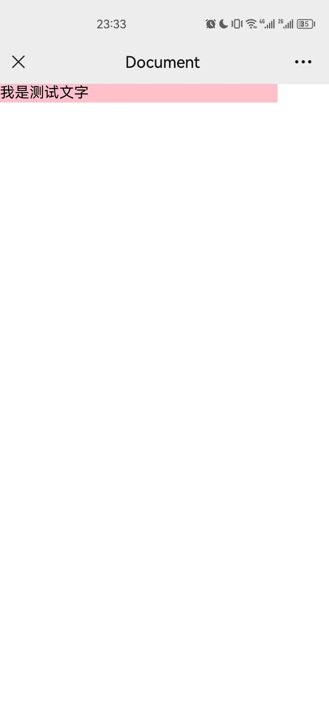
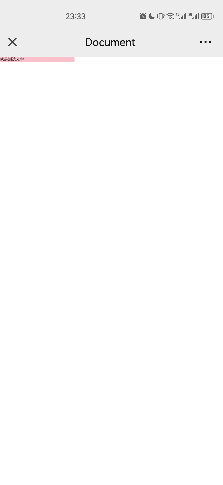

[toc]

# 背景

根据设计师专门出的移动端H5设计稿，按照设计稿的尺寸需要适配不同尺寸大小的移动设备展示【屏幕大，元素大，屏幕小，元素小】，让其不要出现横向滚动条，页面元素展示良好，效果与设计稿一致

就拿下图来说，左侧是效果图，文字部分大小看起来，按照 pc 端常用的字体大小大概在 12px 的样子，但是设计图给出的却是 28px ，这个时候，我们开发应该怎么设置这个文字大小呢【mastergo设计稿x750】




# 相关概念

## 750 vs 375

常见的移动端设计稿是 750 px，参考的 iphone6 的尺寸使用的二倍稿

- iphone6 的宽度按照 css 像素的单位是 375px，所以二倍就是 750px
- 也就是说，如果你页面只给 iphone6 使用，750 设计稿给的宽度是 200px，那么实际应用时，宽度只需要写 100px 即可
- 如果是其他尺寸，750 / 设备宽度 = 200px / 实际大小
- 也就是说只要知道设备的宽度，就能确定对应元素的大小了
- 如何获取设备的宽度呢？

## viewport

视窗/视口：表示浏览器的可视区域，也就是浏览器中用来显示网页的那部分区域

PC 端，视口 = 浏览器窗口大小【也就是拖拽控制台，resize时，视口是一个变动的值】

移动端，涉及三个视口概念

### 布局视口

- 宽度即HTML的宽度【document.documentElement.clientWidth || document.body.clientWidth】，默认是 980

  

- 是相对单位推算的根源，比如说 %、vw，媒体查询等都是根据 html 的宽度来计算的
  如下图，第一个是设置布局视口宽度为屏幕宽度，第二个是默认的 980 的宽度【有了滚动条】，同样 20vw 的文字，显示效果不一样

  

  

  

### 视觉视口

- 视觉视口是屏幕的可视部分，不包括屏幕键盘，缩放外的区域【视觉视口就是浏览器的宽高】

  - PC 端浏览器窗口可以随意改变【缩小浏览器窗口、打开控制台】

  - 移动端，基本不支持改变浏览器宽高，就等于屏幕大小

- 视觉视口要么跟布局视口相同，要么更小，相同时没有滚动条，小时出现滚动条

  

- 视觉视口可以变化：双指缩放放大，或者显示键盘等，视觉视口将会变小【布局视口不变】

  - 缩放放大：CSS 像素将跨越更多的物理像素 =》 感觉内容变大了，能看到的内容变少了
  - 缩放程度和视觉视口的大小是逆相关的：缩放程度越大，视觉视口越小
  - PC端的 ctrl + 鼠标左键进行的缩放，其实是改变了设备像素比 dpr

- 设备像素比 dpr = 物理像素 dp / 设备独立像素 dip

  - js 中获取值 dpr = window.devicePixelRatio

  - 物理像素（设备像素）：设备的实际像素，主要由设备自身的硬件所决定，同一类型的设备物理像素固定的（iphone6的物理像素是 750，屏幕宽度是 375）

  - 逻辑像素（设备独立像素、css 像素）：css 中常用的单位 px

  - 一倍屏是指 1个css 像素对应1个物理像素【比如 PC 端就是这种情况，dpr = 1】

  - 二倍屏是指 1个css像素对应2个物理像素【比如 iphone6, dpr = 2】

  - 屏幕分辨率（物理分辨率），比如 iphone6 的为 750 x 1334，指的是屏幕水平有 750 个像素点，垂直有 1334 个像素点【物理像素】

  - 逻辑分辨率：iphone6 的为 375 x 667
    

  - 逻辑分辨率，简单理解就是跟屏幕的尺寸有关系，是个长度跟视觉的单位
    物理分辨率，简单理解为像素点，跟屏幕的尺寸是没关系的

    小结：一个单位的逻辑像素里包含几个物理像素，包含的物理像素越多， dpr 越大，屏幕显示则越清晰。但因为人视网膜的关系，最多只能识别1个逻辑像素里2个物理像素点，大于2个像素点，人眼识别不出，所以6plus（dpr=3）看上去不会比6（dpr=2）更清晰

- 【-】如何更改视觉视口案例，测试手机 dpr = 3

  - 设置一个布局视口为 900 ```<meta name="viewport" content="width=900, initial-scale=1">```

    初始时，见到的样式如图1，双指操作缩小屏幕，得到如图2
    

    通过缩小屏幕，放大了视觉视口=布局视口（没有滚动条了）

  - 可以通过设置 initial-scale 的值，让初始见到的页面视口=布局视口
    ```js
    (function () {
      let dpr, scale;
      dpr = window.devicePixelRatio || 1;
      scale = 1 / dpr;
      const docEl = document.documentElement;
      const metaEl = document.querySelector('meta[name="viewport"]')
      metaEl.setAttribute('content', 'width=900,initial-scale=' + scale);
    })()
    ```

    疑问：这里的document.documentElement.clientWidth不知道为啥得到的是 1081，两种方式得到的最小页面查看效果不太一样

### 理想视口

布局视口宽度 = 视觉视口宽度 = 设备宽度 这种情况下，属于理想视口

- 不需要缩放和横向滚动就能正常查看网页所有内容

- 可以通过 name="viewport" 的 meta 标签修改布局视口
  ```html
  <meta name="viewport" content="width=device-width, initial-scale=1">
  ```

  - 该标签放在HTML文档的head标签内

  - content 可能值如下图，值类型为字符串，content="key=value, key=value"

  | key           | 说明                                                         |
    | ------------- | ------------------------------------------------------------ |
    | width         | 布局视口的宽度<br />width=device-width<br />width=900【像素为单位】 |
    | initial-scale | 页面的初始缩放程度，0.0到10.0之间的正数<br />initial-scale=1.0 |
    | minimum-scale | 页面最小缩放程度，0.0到10.0之间的正数                        |
    | maximum-scale | 页面最大缩放程度，0.0到10.0之间的正数                        |
    | user-scalable | 是否允许用户对页面进行缩放操作<br />user-scalable=yes【默认】<br />user-scalable=no |
  
  - 注意：viewport 标签只对移动端浏览器有效，对 PC 端浏览器是无效的

# 适配思路

- 前面提到过，750 的设计稿，要适配不同尺寸的设备，只需要按照对应比例缩放元素大小即可
- 750/设备宽度=750上的元素大小/实际大小，可以变形为
  - 750上的元素大小 / 750 = 实际大小/设备宽度
  - 对屏幕宽度来说，也就是设计稿的元素占比多少，实际元素就占比多少
- 所以，**设置成理想视口**之后，就可通过 document.documentElement.clientWidth 的方式得到设备宽度，从而正确设置元素大小
- 目前常用的两种方式是使用 rem 和 vw【都在理想视口基础上，这样方便获取屏幕宽度】

## rem

- css3 新增的相对单位

- css 中 px 单位改为使用 rem，表示相对于根元素的 font-size（默认是 16px，有的浏览器可能不是） 是几倍，通过更改 html 的 font-size，同步更改了页面元素的大小

- 不同的移动端设备尺寸不一，给 html 更改不同的 font-size【根据“对屏幕宽度来说，也就是设计稿的元素占比多少，实际元素就占比多少”】

  - 假设，750px设计稿，分为 7.5 份，则1份的大小为 100px，对于设计稿上的 200px 来说，就只占两份的大小；也就是说如果将根的 font-size 设置为 100px，那么就能将实际元素的大小设置为 2rem，可以得到元素大小为 2 * 100 = 200。
  - 也就是说，font-size=屏幕宽度/7.5
  - 当我的屏幕宽度变为 375 时，这时候根的 font-size = 375 / 7.5 = 50，因为实际元素设置的单位是 2rem，那么实际元素大小 = 2rem * 50 = 100px，满足我们的要求

- 相关插件：[amfe-flexible](https://github.com/amfe/lib-flexible/blob/2.0/index.js)，核心代码如下，这里是将宽度分为了 10 份来计算的

  ```js
  // 设置基准大小
  function setRem () {
    const dom = document.documentElement;
    dom.style.fontSize = (dom.clientWidth / 10) + "px"
  }
  // 初始化
  setRem()
  window.onresize = function () {
    setRem()
  }
  ```

  750 分为 10 份，1 rem = 75px，元素 200px 就有 200/75 = 2.66666666rem；【分为多少份，可以计算出元素占多少 rem】

  设备 375px 则根 font-size = 375/10 = 37.5，这时候元素在 375 宽度上宽度就是 2.66666666rem * 37.5= 100px【分成相同的份数，可以动态给根设置 font-size，方便元素根据 rem 获得真实的大小】

- 实际开发中，设计稿给的都是 px 单位，开发时候不可能人工一一去转为 rem 填到样式中去

  - postcss-plugin-px2rem官方文档：https://www.npmjs.com/package/postcss-plugin-px2rem

  - postcss-pxtorem官方文档：https://www.npmjs.com/package/postcss-pxtorem

  - postcss-px2rem官方文档：https://www.npmjs.com/package/postcss-px2rem

  - 工作原理：告诉它 1 rem 的值是多少（设计稿宽度/10），然后编译时自动计算出 rem 的单位替换原本的 px 单位
    安装依赖：yarn add postcss-pxtorem --dev

    在vue.config.js 中加入配置：

    ```js
    {
        ...
        css: {
        loaderOptions: {
          postcss: {
            postcssOptions: {
              plugins: [
                require('postcss-pxtorem')({ // 把px单位换算成rem单位
                  rootValue : 75, //设计稿宽度的1/10
                  unitPrecision: 5, //（数字）允许REM单位增长的十进制数字
                  replace: true, // （布尔值）替换包含rems的规则，而不添加后备
                  mediaQuery: false, // （布尔值）允许在媒体查询中转换px
                  minPixelValue: 0, // （数字）设置要替换的最小像素值
                  selectorBlackList: [], // 忽略转换正则匹配项
                  propList: ['*'], // 可以从px转换为rem的属性，匹配正则
                  exclude: /node_modules/i // （字符串，正则表达式，函数）要忽略并保留为px的文件路径
                })
              ]
            }
          }
        }
      }
    }
    
    ```

    或者根目录下 postcss.config.js

    ```js
    module.exports = {
      plugins: {
        'postcss-pxtorem': {
          rootValue : 75, //设计稿宽度的1/10
          unitPrecision: 5, //（数字）允许REM单位增长的十进制数字
          replace: true, // （布尔值）替换包含rems的规则，而不添加后备
          mediaQuery: false, // （布尔值）允许在媒体查询中转换px
          minPixelValue: 0, // （数字）设置要替换的最小像素值
          selectorBlackList: [], // 忽略转换正则匹配项
          propList: ['*'], // 可以从px转换为rem的属性，匹配正则
          exclude: /node_modules/i // （字符串，正则表达式，函数）要忽略并保留为px的文件路径
         }
      }
    }
    ```

    如果是 vite 打包，可以 vite.config.js

    ```js
    // viet.config.js
    {
        ...
        css: {
          postcss: {
            plugins: [
              postCssPxToRem({
                rootValue: 75,
                propList: ["*"]...
              })
            ]
          }
        }
    }
    ```

    

    如果某个值不进行 rem 转换，可以使用 Px 或者 PX 作为单位【css大小写不敏感】

    

## vw

> lib-flexible 文档中，表示 flexible 方案已经可以废弃，推荐使用 vw 视口单位进行适配
>
> ```js
> 由于viewport单位得到众多浏览器的兼容，lib-flexible这个过渡方案已经可以放弃使用，不管是现在的版本还是以前的版本，都存有一定的问题。建议大家开始使用viewport来替代此方
> ```


- css3 中新增的 vw 单位，100vw = 屏幕宽度

- 编程中元素的单位使用 vw

- 750 的设计稿，100vw = 750px，1vw = 7.5px，200px的元素应该多少vw呢？=200/7.5=26.6666...vw

- 在 375 的屏幕上，100vw = 375px，1vw = 3.75px，26.6666...vw = 3.75 * 26.666 = 100px

- 同样，设计稿是 px 单位，开发时候不可能人工一一去转为 vw 填到样式中去

- 插件  [postcss-px-to-viewport](https://www.npmjs.com/package/postcss-px-to-viewport) 

  安装依赖：yarn add postcss-px-to-viewport --dev

  在 vue.config.js 中加入配置

  ```js
  安装依赖：yarn add postcss-px-to-viewport --dev
  
  在 vue.config.js 中加入配置
  {
      ...
      css: {
      loaderOptions: {
        postcss: {
          postcssOptions: {
            plugins: [
              require('postcss-px-to-viewport')({
                unitToConvert: 'px', // 要转化的单位
                viewportWidth: 750, // UI设计稿的宽度
                unitPrecision: 6, // 转换后的精度，即小数点位数
                propList: ['*'], // 指定转换的css属性的单位，*代表全部css属性的单位都进行转换
                viewportUnit: 'vw', // 指定需要转换成的视窗单位，默认vw
                fontViewportUnit: 'vw', // 指定字体需要转换成的视窗单位，默认vw
                selectorBlackList: ['wrap'], // 指定不转换为视窗单位的类名，
                minPixelValue: 1, // 默认值1，小于或等于1px则不进行转换
                mediaQuery: true, // 是否在媒体查询的css代码中也进行转换，默认false
                replace: true, // 是否转换后直接更换属性值
                exclude: [/node_modules/], // 设置忽略文件，用正则做目录名匹配
                landscape: false, // 是否处理横屏情况
              })
            ]
          }
        }
      }
    },
  }
  ```


## rem vs vw

rem：

- 需要引入一段JS代码【给根元素设置了样式】，这样违背了样式行为分离的思想，而且耦合深，无法解耦
- 完全兼容需要Android2.1+和ios6+

vw：

- 不用通过js计算，直接使用即可，但是兼容性却不如rem
- 完全兼容需要Android4.4+和ios8+


# vue 项目中实际应用-rem

安装依赖：

- yarn add amfe-flexible

- yarn add postcss-pxtorem -D

main.js 中：

- import "amfe-flexible";

vite.config.js：

```js
css: {
      postcss: {
        plugins: [
          postCssPxToRem({
            rootValue: 37.5, // vant 官方的根字体大小 37.5
            propList: ["*"]
          })
        ]
      }
    }
```

如果参考的是 750 的设计稿，因为这里配置的是 375 的设计稿，所以对应的 px 单位的数值开发的时候需要写一半

也就是说，回到背景中那张图，28px 在开发时只需要写 14px 即可

# 参考

[移动端web开发的设计稿与工作流](https://juejin.cn/post/6844903731285196813)

[Web移动端最强适配方案，很好用！【两类方案对比】](https://zhuanlan.zhihu.com/p/291013307)

[视口深入理解](https://www.jianshu.com/p/7c5fdf90c0ef)

[移动端适配相关概念](https://juejin.cn/post/7046169975706353701)

[前端开发之devicePixelRatio,viewport深入理解](https://juejin.cn/post/7065330958932803620)

[视口总结](https://juejin.cn/post/6958755936529809439)

[像素 / 分辨率 / 物理像素和逻辑像素](https://juejin.cn/post/6844904094344151054)
