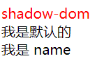
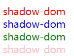
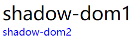

# 基础

## shadow dom

开一个黑盒，方便里面的内容与外界隔离，与 iframe 中的 #document 差不多意思

```html
  <my-div></my-div>
  <script>
    class MyDiv extends HTMLElement {
      constructor() {
        super();
        this.attachShadow({ mode: "open" });
        this.shadowRoot.innerHTML = `<div style="color: red">shadow-dom</div>`;
      }
    }
    customElements.define("my-div", MyDiv);
  </script>
```

## template

使用 template 标签包裹的内容不会渲染在 dom 树中，可使用 js 获取到用来定义 web compont 的 html 结构

```html
  <my-div></my-div>
  <template id="myDiv">
    <div style="color: red">shadow-dom</div>
  </template>
  <script>
    class MyDiv extends HTMLElement {
      constructor() {
        super();
        this.attachShadow({ mode: "open" });
        const templateDom = document.querySelector("#myDiv");
        // 别的地方也可能使用，所以这里创建一个副本使用
        const cloneTemplate = templateDom.content.cloneNode(true);
        this.shadowRoot.appendChild(cloneTemplate);
      }
    }
    customElements.define("my-div", MyDiv);
```

## slot

```html
  <my-div>
    <div slot="name">我是 name </div>
    我是默认的
  </my-div>
  <template id="myDiv">
    <div style="color: red">shadow-dom</div>
    <slot></slot>
    <slot name="name"></slot>
  </template>
```



## 样式传递

在外部有如下方式可以影响 web component 组件的样式：

- 伪类
- css  variable（css 变量）

### :host

- :host：对 wc 组件根元素生效
- :host(选择器)：wc 组件根元素与选择器匹配的才生效
- :host-context(选择器)：wc 组件根元素是选择器子级的生效



```html
<my-div></my-div>
  <my-div class="blue-color"></my-div>
  <my-div class="green-color"></my-div>
  <div class="content">
    <my-div></my-div>
  </div>
  <template id="myDiv">
    <div>shadow-dom</div>
  </template>
  <script>
    class MyDiv extends HTMLElement {
      constructor() {
        super();
        this.attachShadow({ mode: "open" });
        const templateDom = document.querySelector("#myDiv");
        const cloneTemplate = templateDom.content.cloneNode(true);
        const styleDom = document.createElement("style")
        styleDom.innerHTML = `
          :host {
            color: red;
            font-size: 16px;
          }
          :host(.blue-color) {
            color: blue;
          }
          :host(.green-color) {
            color: green;
          }
          :host-context(div.content) {
            color: pink;
          }
        `;
        this.shadowRoot.appendChild(cloneTemplate);
        this.shadowRoot.appendChild(styleDom);
      }
    }
    customElements.define("my-div", MyDiv);
  </script>
```


### ::part



```html
 <style>
    my-div::part(part1) {
      color: black;
      font-size: 30px;
    }
    my-div::part(part2) {
      color: blue;
    }
  </style>

  <my-div></my-div>
  <template id="myDiv">
    <div part="part1">shadow-dom1</div>
    <div part="part2">shadow-dom2</div>
  </template>
  <script>
    class MyDiv extends HTMLElement {
      constructor() {
        super();
        this.attachShadow({ mode: "open" });
        const templateDom = document.querySelector("#myDiv");
        const cloneTemplate = templateDom.content.cloneNode(true);
        const styleDom = document.createElement("style")
        styleDom.innerHTML = `
          :host {
            color: red;
            font-size: 16px;
          }
        `;
        this.shadowRoot.appendChild(cloneTemplate);
        this.shadowRoot.appendChild(styleDom);
      }
    }
    customElements.define("my-div", MyDiv);
```

### css 变量

```html
<style>
    my-div {
      --color: green;
      --size: 80px;
    }
  </style>

<my-div></my-div>
  <template id="myDiv">
    <div>shadow-dom</div>
  </template>
  <script>
    class MyDiv extends HTMLElement {
      constructor() {
        super();
        this.attachShadow({ mode: "open" });
        const templateDom = document.querySelector("#myDiv");
        const cloneTemplate = templateDom.content.cloneNode(true);
        const styleDom = document.createElement("style")
        styleDom.innerHTML = `
          :host {
            color: var(--color);
            font-size: var(--size);
          }
        `;
        this.shadowRoot.appendChild(cloneTemplate);
        this.shadowRoot.appendChild(styleDom);
      }
    }
    customElements.define("my-div", MyDiv);
  </script>
```


## 生命周期


js库：lit

web components 谷歌插件


attribute：dom 标签上的直接赋予的属性，只能是 string、number、boolean，如 href：`<a href="xxx" >`

property：js  赋予的属性，是包含 attribute 的。如 abc： `document.getElementById("myId").abc = 111`

属性传递

css 传递: css 变量值可以穿透

```css
:host {}
```

# 别人的UI库

carbondesignsystem

sheoelace.style

UI5

spectrum

wiredjs

vscode


