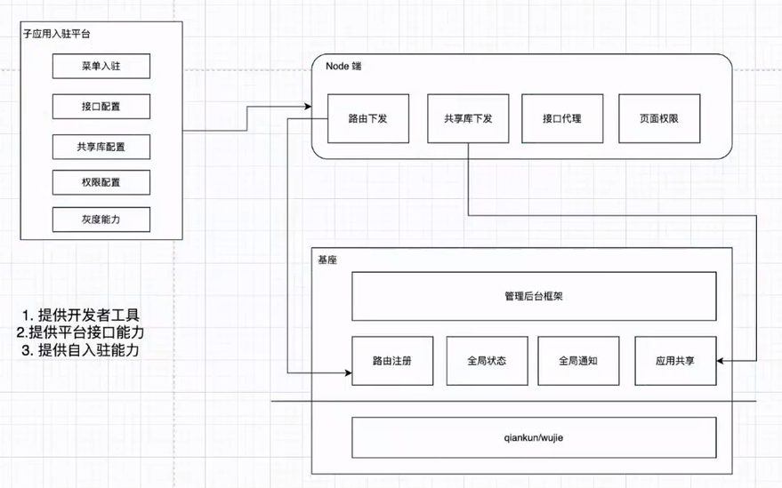

# 微前端是啥

微前端就是将 iframe 组装页面的功能使用微前端框架实现，iframe 能实现的微前端都能实现

一个父应用中可以加载多个子应用，在父应用中加载子应用入口，这个入口是一段 js 或者 html

## iframe 问题

- 路由同步困难：内部路由在外部是无感知的
- UI 状态，内部无法覆盖外部，比如弹窗
- iframe 里面的是独立进程，消耗很大

## 微前端

1. 提升开发体验，提高性能【比起 iframe】
2. 组合不同的前端技术栈构成页面（聚合前端应用）
3. 拆分应用，提升开发效率，子应用可独立上线，互不干涉

使用场景：

- 组合各个页面
- 页面性能不敏感场景
- 管理后台类场景

## 核心原理

应用隔离：

- js 隔离
- 样式 隔离
- 路由同步

# 实现方案

## microapp

## qiankun - 19年

- 解析 html
- 路由同步
- js 沙箱
- 样式隔离
  - 没有特别处理
    - 子应用自己解决：css modules，vue 的 scoped
    - web components 的技术方案：shadowdom，font 字体是不能放 shadowdom 加载的
- 应用通信
  - 订阅发布

## garfish

## 无界

- 样式隔离 - web components
- js 隔离-iframe 沙箱隔离
- 路由同步

## single-spa - 18年

# 微前端设计

