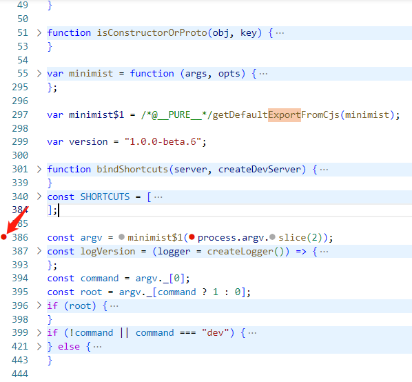
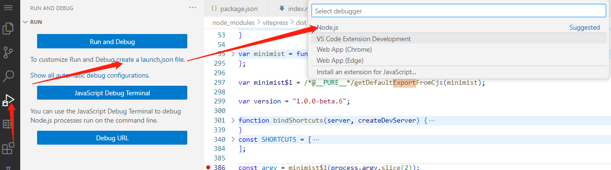
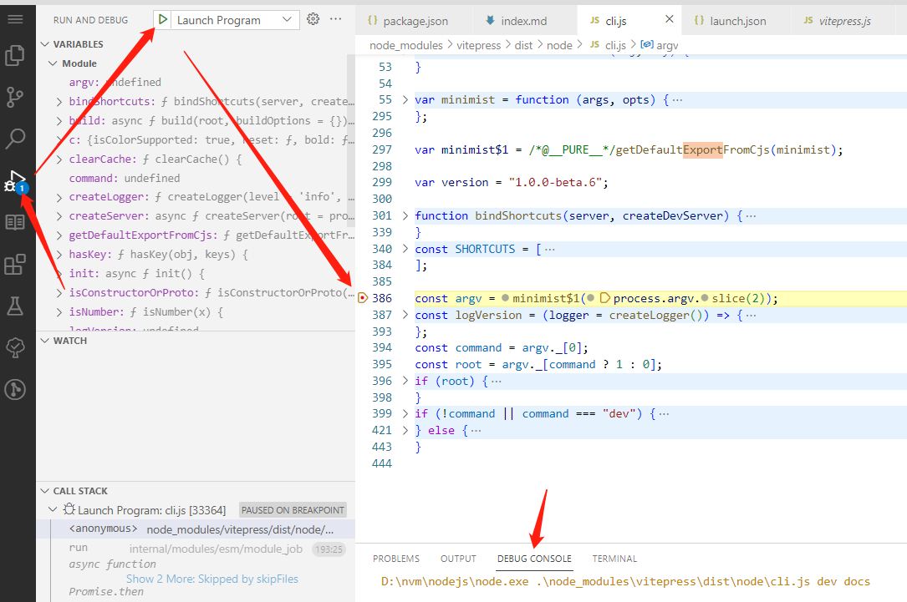

# 调试 node_modules 下的逻辑

以一个 vitepress 项目为例，本地启动服务器命令为：vitepress dev docs，想研究一下 vitepress 怎么工作的，准备进去打断点调试看看逻辑

1. 进入 node_modules 找到 vitepress 包下的 package.json 的 bin 节点，这里会显示这个包可以执行哪些命令并且这些命令对应执行哪个 js 文件
   ```js
   "bin": {
       "vitepress": "bin/vitepress.js"
   }
   ```

2. 可以看到，vitepress 命令执行的文件是 bin 目录下的 vitepress.js 文件，这个文件中只是使用 import 引入了另一个文件，所以真正执行的是 dist/node/cli.js，可以去这个文件中打断点
   ```js
   import('../dist/node/cli.js')
   ```

3. 找到这个文件中的立即执行函数的位置，这个文件中本身是敞开的没有定义立即执行函数，所以找到对应的要调试的地方打断点即可
   

4. vscode 中找到 Run and Debug 的图标，然后选择 node 生成配置文件

   

5. 修改配置文件如下
   ```json
   {
     "version": "0.2.0",
     "configurations": [
       {
         "type": "node",
         "request": "launch",
         "name": "Launch Program",
         "skipFiles": [
           "<node_internals>/**" // 表示跳过 node 内部模块
         ],
         // 启动项目的入口文件地址
         "program": "${workspaceFolder}\\node_modules\\vitepress\\dist\\node\\cli.js",
         "args": ["dev", "docs"]
       }
     ]
   }
   ```

   主要修改了

   - program ，改为启动文件地址
   - args，添加启动命令所需的参数

6. F5 或者点击左上角图标启动程序，进入断点，在 debug console 可以看到 console 的输出结果
   

