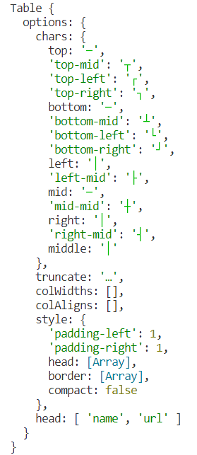
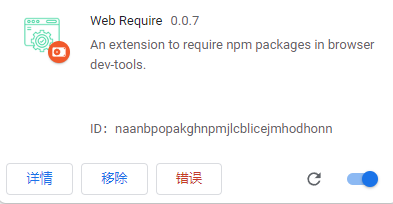

# Chrome插件 - 在浏览器控制台引入npm包

## 需求：想临时调试一个 npm 包

- 比如说 "cli-table" 插件，我想看看实例上有哪些方法，在 nodejs 环境打印出来的不能满足我的需求，需要使用浏览器环境打印看结果
  ```js
  const Table = require('cli-table')
  
  const table = new Table({
    head: ['name', 'url'],
    style: {
      head: ['green']
    }
  })
  console.log(table)
  ```

  



- 比如 dayjs，在项目中我使用其相关方法写了一个函数逻辑，我想测试几个数据验证其正确性，这时候要么只能去官网 F12 打开控制台去定义这个函数然后执行测试，要么只能启动项目，触发函数执行在控制台看打印效果。总是没有随时打开 F12 控制台定义函数测试方便【项目中有 install 这个 npm 但需要在源码中编码，无法控制台中使用变量；官网本身也有这个依赖逻辑，所以控制台中可以使用 dayjs 变量】

## 安装插件

- [下载 webext-require 插件 ](https://github.com/kricsleo/webext-require) 的 zip 包
- 打开 Chrome 的插件扩展页：chrome://extensions

- 将 zip 拖拽到页面上安装即可



发现报错了：

1. 'action' requires manifest version of at least 3.
2. Manifest version 2 is deprecated, and support will be removed in 2023. 

解决：将 manifest.json 版本号改为 3："manifest_version": 3

[解决思路参考](https://blog.csdn.net/ljinkai_ljk/article/details/125127805) 没成功使用！！！目前好像还不支持版本3的


## 如何使用


在 chrome 中随意一个页签，f12 打开控制台，

- 安装：
  - npm 包：_require("cli-table")


# 从零开发类似插件

https://zhuanlan.zhihu.com/p/434057940